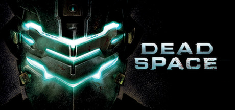

<h1 align="center">
<br>
Dead Space · PSVita Port
</h1>
<p align="center">
  <a href="#setup-instructions-for-players">How to install</a> •
  <a href="#controls">Controls</a> •
  <a href="#faq">FAQ</a> •
  <a href="#known-issues">Known Issues</a> •
  <a href="#build-instructions-for-developers">How to compile</a> •
  <a href="#credits">Credits</a> •
  <a href="#license">License</a>
</p>

Dead Space is a 2011 survival horror mobile game for iOS and Android devices.
A spin-off within the Dead Space series, the game is set after the events
of original Dead Space and prior to the events of Dead Space 2 and shows
how the Necromorph outbreak began and spread through the Titan Sprawl.

This repository contains a loader of **the Xperia Play release of Dead Space**,
based on the [Android SO Loader by TheFloW][gtasa]. The loader provides
a tailored, minimalistic Android-like environment to run the official ARMv6
game executable on the PS Vita.

Disclaimer
----------------

**DEAD SPACE** is a registered trademark of Electronic Arts Inc. The work
presented in this repository is not "official" or produced or sanctioned by
the owner(s) of the aforementioned trademark or any other registered trademark
mentioned in this repository.

This software does not contain the original code, executables, assets, or
other non-redistributable parts of the original game product. The authors of 
this work do not promote or condone piracy in any way. To launch and play
the game on their PS Vita device, users must possess their own legally obtained
copy of the game in form of an .apk file.

Setup Instructions (For Players)
----------------

In order to properly install the game, you'll have to follow these steps
precisely:

- Install or update [kubridge][kubridge] and [FdFix][fdfix] by copying
`kubridge.skprx` and `fd_fix.skprx` to your taiHEN plugins folder
(usually `ur0:tai`) and adding two entries to your `config.txt` under `*KERNEL`:

```
  *KERNEL
  ur0:tai/kubridge.skprx
  ur0:tai/fd_fix.skprx
```

```diff
! ⚠️ Don't install `fd_fix.skprx` if you're using the rePatch plugin!
```

```diff
- ⚠️ Even if you had `kubridge.skprx` installed before, most likely you still
- need to update it, since a new version of the plugin was released at the same
- time as this port. kubridge v0.3 or newer is required to run the game!
```

- Make sure you have `libshacccg.suprx` in the `ur0:/data/` folder on your
console. If you don't, use [ShaRKBR33D][shrkbrd] to get it quickly and easily.

- <u>Legally</u> obtain your copy of Dead Space Mobile for Xperia Play in a form
of an `.apk` file. The version for regular Android devices, also known as
the latest/Google Play version, **will not work**! Make sure that your game is
**v1.1.33** (this is the last one supported on Xperia Play and provided via
EA Store back in 2012).

    - If you have it installed on your phone, you can 
        [get all the required files directly from it][unpack-on-phone]
        or by using any APK extractor you can find on Google Play.

> ℹ️ Verify that your build is the correct one using **sha1sum** (can also
> be found as an online tool). sha1sum for `lib/armeabi/libEAMGameDeadSpace.so`
> must be `0ed42b611415015807f759ec9b5457857143ce39`

- Open the `.apk` with any zip explorer (like [7-Zip](https://www.7-zip.org/))
and extract all folders from the `.apk` into `ux0:data/deadspace` on your Vita.
Example of correct resulting path: `ux0:data/deadspace/lib/armeabi/libEAMGameDeadSpace.so`

- If your `.apk` was less than 100MB of size, you also need assets ("cache").
You need to run the game at least once on your Xperia so that it downloads the
required files, and then you can find them at `/sdcard/ea/deadspace/published`.
Copy the `published` folder to `ux0:data/deadspace/assets/` on your Vita.
Example of correct resulting path: `ux0:data/deadspace/assets/published/data/achievements.sb`

- Install `DeadSpace.vpk` (from [Releases][latest-release]).

Controls
-----------------

|       Button        | Action                                  |
|:-------------------:|:----------------------------------------|
| ![joysl] / ![joysr] | Move / Control camera                   |
| ![trigl] / ![trigr] | Aim / Fire                              |
|      ![dpadh]       | Previous / Next Weapon                  |
|      ![dpadv]       | Plasma Saw Attack / Locator             |
|      ![cross]       | Interact with doors, items              |
|      ![circl]       | Activate Kinesis                        |
|      ![squar]       | Reload weapon                           |
|      ![trian]       | Quick Turn / Stasis (when aiming)       |
|      ![selec]       | Show HUD                                |
|      ![start]       | Open Menu                               |
| Accelerometer Tilt  | Switch weapon fire mode                 |
| Accelerometer Shake | Jump in Zero-G                          |

FAQ
----------------

❓ **As soon as I run the app, I get "An error has occured in the following
application. (C2-12828-1)" message. What to do?**<br>
❕ Most likely, it means that after updating/installing the kubridge plugin, you
didn't reboot your console. Reboot is required after any modifications in kernel
plugins. If the problem persists after reboot, please [post a new issue][issue].


❓ **How do I change the language of the game?**<br>
❕ You can change the language in Settings but only if you open them from
**Main Menu**. So if you start a fresh playthrough that begins with
the cinematic, wait till its end, quit to the main menu, and change the language
in settings.

❓ **I reached the Zero-G zone and can not jump, no matter how hard I shake the
Vita. How to pass it?**<br>
❕ First, make sure that you are actually looking at a platform you can jump on.
If you are, your crosshair must turn green. Then, instead of shaking, tilt the
top part of the console towards you in a fast motion. Make sure you are not
actually aiming using ![trigl]; you need to only *look* at the target, not aim
with a weapon.

❓ **How to defeat the boss in Chapter 6? He runs towars me and kills in one
or two hits, making it impossible to damage him.**<br>
❕ Use Stasis (aim with ![trigl] and press ![trian]) to incapacitate the boss.
Then walk behind him (this is crucial since he takes little to no damage from
the front) and aim and shoot at his limb joint to cut them. Line Gun is
recommended as it deals more damage than Plasma Cutter.

❓ **Is PlayStation TV supported?**<br>
❕ Yes, but you'd have to install [DSMotion][dsmotion] and [DS4Touch][ds4touch]
to be able to navigate the menus (they don't support gamepad controls) and use
accelerometer.

❓ **Any other question?**<br>
❕ Check the following "Known Issues" section. If nothing there looks like the
problem you're having, please [post a new issue][issue], and I'll try my best
to help you.

Known Issues
----------------

1. While the game has a subtitles option, it's recommended not to use them
because in some scenes they skip immediately. Most likely, can not be fixed.
2. Rarely (about once an hour or sometimes during new levels/saves loading),
the game can randomly crash or freeze. You'll have to restart it. Game creates
checkpoint saves pretty often, so you shouldn't lose any substantial progress.
3. Sometimes (most oftenly reported when entering the tram at the end of
Chapters 5/9/10), audio may stop working. If it happens, play until the next
checkpoint if you wish and restart the game (as in quit and open the app again).

Build Instructions (For Developers)
----------------

In order to build the loader, you'll need a [vitasdk](https://github.com/vitasdk)
build fully compiled with softfp usage. The easiest way to obtain one is
following the instructions on https://vitasdk.org/ while replacing the URL in
this command:
```bash
git clone https://github.com/vitasdk/vdpm
```
Like this:
```bash
git clone https://github.com/vitasdk-softfp/vdpm
```

All the required libraries should get installed automatically if you follow the
installation process from https://vitasdk.org/.

After all these requirements are met, you can compile the loader with the
following commands:

```bash
cmake -Bbuild .
cmake --build build
```

Also note that this CMakeLists has two "convenience targets". While developing,
I highly recommed using them, like this:
```bash
cmake --build build --target send # Build, upload eboot.bin and run (requires vitacompanion)
cmake --build build --target dump # Fetch latest coredump and parse
```

For more information and build options, read the [CMakeLists.txt](CMakeLists.txt).

Credits
----------------

- [Andy "The FloW" Nguyen][flow] for the original .so loader.
- [Rinnegatamante][rinne] for VitaGL and lots of help with understanding and
debugging the loader.
- [Bythos][bythos] for the new kubridge with exceptions handling support and
short vector VFP emulation and code generation.
- [CatoTheYounger][cato] for **tremendous** amount of testing. Not the hero we
deserved, but the one we need.
- [Once13One][o13o] for his beautiful LiveArea assets.
- Andiweli, AvatarIII, BignThicc, dangtruong23, DieterB, Havocking92, ivanproff,
keeponjammin, Long-nose, Maplesyrup6661, maxbarno, mmtechnodrone, NeoTechni,
ReAnimation9, Shaitan, stayntruebreal, thenoble1, Tibmyyy: backers of the
[bounty][bounty] that gave me motivation and made this port possible.

License
----------------

This software may be modified and distributed under the terms of
the MIT license. See the [LICENSE](LICENSE) file for details.

[cross]: https://raw.githubusercontent.com/v-atamanenko/sdl2sand/master/img/cross.svg "Cross"
[circl]: https://raw.githubusercontent.com/v-atamanenko/sdl2sand/master/img/circle.svg "Circle"
[squar]: https://raw.githubusercontent.com/v-atamanenko/sdl2sand/master/img/square.svg "Square"
[trian]: https://raw.githubusercontent.com/v-atamanenko/sdl2sand/master/img/triangle.svg "Triangle"
[joysl]: https://raw.githubusercontent.com/v-atamanenko/sdl2sand/master/img/joystick-left.svg "Left Joystick"
[joysr]: https://raw.githubusercontent.com/v-atamanenko/sdl2sand/master/img/joystick-right.svg "Left Joystick"
[dpadh]: https://raw.githubusercontent.com/v-atamanenko/sdl2sand/master/img/dpad-left-right.svg "D-Pad Left/Right"
[dpadv]: https://raw.githubusercontent.com/v-atamanenko/sdl2sand/master/img/dpad-top-down.svg "D-Pad Up/Down"
[selec]: https://raw.githubusercontent.com/v-atamanenko/sdl2sand/master/img/dpad-select.svg "Select"
[start]: https://raw.githubusercontent.com/v-atamanenko/sdl2sand/master/img/dpad-start.svg "Start"
[trigl]: https://raw.githubusercontent.com/v-atamanenko/sdl2sand/master/img/trigger-left.svg "Left Trigger"
[trigr]: https://raw.githubusercontent.com/v-atamanenko/sdl2sand/master/img/trigger-right.svg "Right Trigger"

[gtasa]: https://github.com/TheOfficialFloW/gtasa_vita
[kubridge]: https://github.com/bythos14/kubridge/releases/
[fdfix]: https://github.com/TheOfficialFloW/FdFix/releases/
[unpack-on-phone]: https://stackoverflow.com/questions/11012976/how-do-i-get-the-apk-of-an-installed-app-without-root-access
[shrkbrd]: https://github.com/Rinnegatamante/ShaRKBR33D/releases/latest
[latest-release]: https://github.com/v-atamanenko/deadspace-vita/releases/latest
[issue]: https://github.com/v-atamanenko/deadspace-vita/issues/new
[dsmotion]: https://github.com/OperationNT414C/DSMotion/releases
[ds4touch]: https://github.com/MERLev/ds4Touch/releases

[flow]: https://github.com/TheOfficialFloW/
[rinne]: https://github.com/Rinnegatamante/
[bythos]: https://github.com/bythos14/
[cato]: https://github.com/CatoTheYounger97/
[o13o]: https://github.com/once13one/
[bounty]: https://app.bountysource.com/issues/96950715-dead-space-android-port-for-ps-vita
